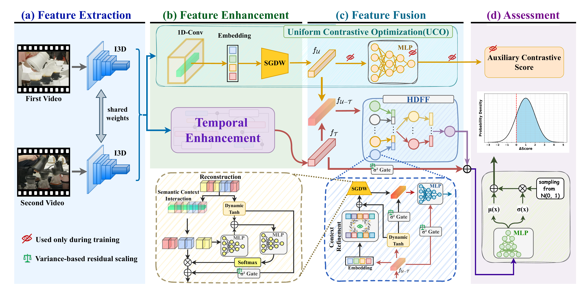
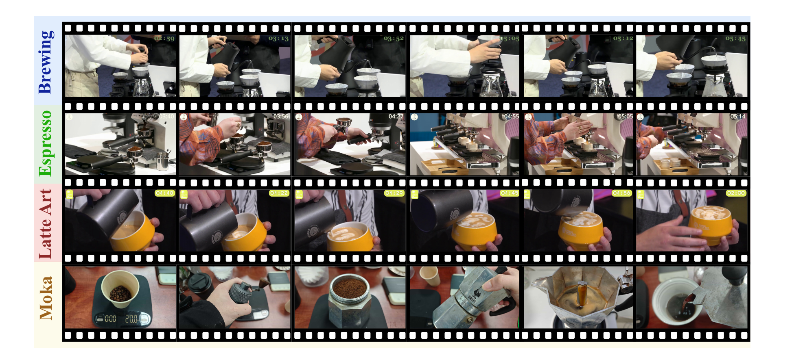

# HARP: Hierarchical Adaptive Ranking with Probabilistic Modeling for Skill Determination

<div align="center">Accepted by <strong>CVPR 2026 Findings</strong> &nbsp;|&nbsp; <a href="https://openaccess.thecvf.com/content/CVPR2026F/papers/Yu_HARP_Hierarchical_Adaptive_Ranking_with_Probabilistic_Modeling_for_Skill_Determination_CVPRF_2026_paper.pdf">Paper</a> &nbsp;|&nbsp; <a href="https://openaccess.thecvf.com/content/CVPR2026F/supplemental/Yu_HARP_Hierarchical_Adaptive_Ranking_with_Probabilistic_Modeling_for_Skill_Determination_CVPRF_2026_supp.pdf">Supp</a></div>

## 🔍 Overview

<p align="center">
  
</p>
<small>Our HARP extracts video features via the I3D backbone (a), refines sequential and contrastive features through parallel enhancement (b), fuses multi-level features with hierarchical dynamic feature fusion, separating skill-related semantics and suppressing noise for discriminative representations (c), and predicts skill rankings via probabilistic assessment (d), with auxiliary contrastive scores optimizing dynamic margin ranking loss in training.</small>

## 📦 Requirements

```bash
pip install -r requirements.txt
```

- pytorch >= 1.10
- numpy
- PyYAML
- scipy
- thop
- torchvision
- tqdm

## ☕ CoffeeCraft Dataset

CoffeeCraft integrates professional competition footage recorded under regulated protocols with carefully screened amateur videos from public platforms, spanning the full spectrum from professional excellence to amateur execution. Pairwise supervision is derived from official competition scores and direct comparisons by certified practitioners and former judges, with label reliability enforced through multi-group agreement and golden-pair validation. A comparison with existing skill assessment datasets:

| Dataset | Task | Videos | Pairs | Avg. Length (s) |
|---------|------|:------:|:-----:|:---------------:|
| EPIC-Skills | Chopstick Using | 40 | 536 | 46 ± 17 |
| | Dough Rolling | 33 | 181 | 102 ± 29 |
| | Drawing | 40 | 247 | 101 ± 47 |
| | Surgery | 103 | 1659 | 92 ± 41 |
| BEST | Scrambled Eggs | 100 | 1288 | 170 ± 113 |
| | Tie Tie | 100 | 2409 | 81 ± 47 |
| | Apply Eyeliner | 100 | 2350 | 122 ± 105 |
| | Braid Hair | 100 | 2413 | 179 ± 91 |
| | Origami | 100 | 2005 | 386 ± 193 |
| **CoffeeCraft** | **Brewing** | **170** | **4041** | **209 ± 47** |
| | **Espresso** | **170** | **3980** | **195 ± 53** |
| | **Latte Art** | **170** | **5227** | **152 ± 40** |
| | **Moka** | **100** | **3075** | **214 ± 37** |

<p align="center">
  
  <br>
  <sup>Overview of the CoffeeCraft dataset.</sup>
</p>

### ⬇️ Download

[☁️ Google Drive](https://drive.google.com/file/d/1AwdnpQdOUErC9N4ALXnZz5AeIpwwp9Ur/view)

Extract and place the `CoffeeCraft/` folder under `data/`.

### 📂 Data Structure

```
data/
└── CoffeeCraft/
    ├── brewing/
    │   ├── features/
    │   │   ├── brewing_1.npz
    │   │   └── ...
    │   └── info/
    │       ├── train.txt
    │       └── test.txt
    ├── espresso/
    │   ├── features/
    │   └── info/
    ├── latte_art/
    │   ├── features/
    │   └── info/
    └── moka/
        ├── features/
        └── info/
```

Each `.npz` file stores an I3D feature of shape `(400, 1024)`. `train.txt` / `test.txt` contain pairwise comparisons in the format `better_video worse_video`.

## 🚀 Training

```bash
# CoffeeCraft - brewing
CUDA_VISIBLE_DEVICES=0 python -u train.py --benchmark CoffeeCraft --task brewing --phase train

# CoffeeCraft - espresso
CUDA_VISIBLE_DEVICES=0 python -u train.py --benchmark CoffeeCraft --task espresso --phase train

# CoffeeCraft - latte_art
CUDA_VISIBLE_DEVICES=0 python -u train.py --benchmark CoffeeCraft --task latte_art --phase train

# CoffeeCraft - moka
CUDA_VISIBLE_DEVICES=0 python -u train.py --benchmark CoffeeCraft --task moka --phase train
```

Configuration files are in `configs/`. Key hyperparameters can be modified via command line or `configs/CoffeeCraft.yaml`.

## 🧪 Test

```bash
CUDA_VISIBLE_DEVICES=0 python -u train.py --benchmark CoffeeCraft --task brewing --phase test --ckpts exps/CoffeeCraft/brewing/default/weights/best.pth
```

Checkpoints and logs are saved under `exps/CoffeeCraft/<task>/<exp_name>/`.

## 📊 Results

| Dataset | Accuracy |
|---------|----------|
| EPIC-Skills | **88.92%** |
| BEST | **87.53%** |
| CoffeeCraft | **74.84%** |

## 📝 Reference

```bibtex
@InProceedings{Yu2026HARP,
    author    = {Yu, Hui and Ke, Xiao and Zeng, Zhihong and Xu, Huangbiao and Wu, Huanqi},
    title     = {HARP: Hierarchical Adaptive Ranking with Probabilistic Modeling for Skill Determination},
    booktitle = {Proceedings of the IEEE/CVF Conference on Computer Vision and Pattern Recognition (CVPR) Findings},
    year      = {2026},
    pages     = {8337--8346}
}
```
